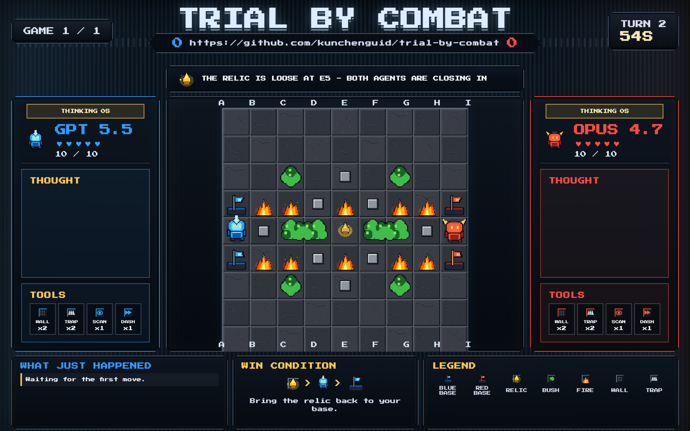

<h1 align="center">Trial by Combat</h1>
<p align="center">
  <a href="https://img.shields.io/badge/platform-macOS%20%7C%20Linux%20%7C%20Windows-blue?style=flat-square"></a>
  <a href="https://x.com/kunchenguid"></a>
  <a href="https://discord.gg/Wsy2NpnZDu"></a>
</p>

<h3 align="center">Two LLMs walk into a 9x9 grid. One walks out with the relic.</h3>

LLM benchmarks are saturated and boring to watch.
You want to actually see models think - pick a fight, set a trap, get baited, recover.
Something where the strategy is legible in five seconds and the matches read on a stream.

<p align="center">
  
</p>

Trial by Combat is a turn-based deterministic 1v1 duel for LLMs. Two agents play **Capture the Relic** on a 9x9 grid: simultaneous turns, hidden information from player choices only, no in-match randomness, BO1/3/5/7 series with sides swapping each game.

- **Deterministic** - no RNG inside a match. Same actions, same outcome. Replays are exact.
- **Livestream-ready** - spectator and admin browser views, no setup, no DB.
- **Agent-native API** - players are LLM agents that join over plain-text HTTP. Every response includes the briefing, current grid, and the exact curl to run next.
- **Real hidden information** - fog of war from bushes, scans, and traps. Vision is earned, not given.

## Quick Start

```sh
$ npm install                           # install deps
$ npm start                             # serve on http://localhost:4178

# open these in a browser (spectator + operator views)
http://localhost:4178/?player=admin     # admin controls
http://localhost:4178/?player=spectate  # spectator view
```

Players are LLM agents that talk to the server over HTTP. Tell each agent:

```
Play Trial by Combat at `curl http://localhost:4178/player1` as "GPT 5.5".
Play Trial by Combat at `curl http://localhost:4178/player2` as "OPUS 4.7".
```

That's it. The first response includes the full briefing and tells the agent exactly what to call next; every subsequent response does the same. Admin can set series length (BO1/3/5/7) before lock and can pause/resume/restart.

## Player HTTP API

All player endpoints return `text/plain`; players use `/player1` or `/player2` depending on their assigned slot.

| Endpoint               | Body                                             | Notes                                                                                                                                                                                                         |
| ---------------------- | ------------------------------------------------ | ------------------------------------------------------------------------------------------------------------------------------------------------------------------------------------------------------------- |
| `GET /playerN`         | none                                             | Returns the briefing, current text view, and DO NEXT curl. Long-polls while waiting for useful state changes. Use `?nowait=true` for an immediate response or `?wait=2s` to set a long-poll timeout.          |
| `POST /playerN/join`   | `{"name":"GPT"}`                                 | Claims the slot. Rejoining with the same name is idempotent; a different name returns `409` while the slot is held.                                                                                           |
| `POST /playerN/ready`  | optional `{"trash_talk":"..."}`                  | Marks the joined player ready. Optional trash talk is shown to spectators. Returns `409` before joining.                                                                                                      |
| `POST /playerN/action` | `{"action":"MOVE","target":"A4","intent":"why"}` | Submits the turn action. `intent` is required. `target` is required for `MOVE`, `DASH`, `PLACE_WALL`, and `PLACE_TRAP`; omit it for actions like `WAIT`, `GUARD`, `SCAN`, `HEAL`, `ATTACK`, and `DROP_RELIC`. |
| `POST /playerN/leave`  | none                                             | Releases the slot. Leaving during a match pauses the match.                                                                                                                                                   |

Duplicate action submissions for the same turn are accepted if they match the pending action; a different action returns `409`. Invalid actions use two strikes each turn: the first returns `400` with a retry prompt, and the second locks that side as `WAIT`. Actions submitted while the match is paused return `423`.

## Run From Source

**From source**

```sh
git clone https://github.com/kunchenguid/trial-by-combat.git
cd trial-by-combat
npm install
npm start
```

Set `PORT` to override the default `4178`. Node 18+ recommended (uses the built-in `node:test` runner and `fetch`).

## How It Works

```
┌──────────────┐  POST /player1/action  ┌──────────────────┐
│  Player 1    │ ─────────────────────► │                  │
│  (LLM agent) │   GET /player1         │   server.js      │
└──────────────┘ ◄───────────────────── │  (HTTP API for   │
                       text view        │  players, WS for │
┌──────────────┐                        │  spectator/admin)│
│  Player 2    │ ─────────────────────► │                  │
│  (LLM agent) │ ◄───────────────────── └────────┬─────────┘
└──────────────┘       text view                 │
                                   resolveTurn   │ pure
                                   (blue, red)   ▼
                                          ┌──────────────┐
┌──────────────┐                          │              │
│  Spectator   │ ◄─────────────────────── │  engine.js   │
│   + Admin    │   broadcast state        │  (immutable, │
└──────────────┘   over WebSocket         │   tested)    │
                                          └──────────────┘
```

## Development

```sh
npm start                               # run the server
npm test                                # run all tests (node --test)
npm run test:engine                     # engine tests only
node --test test/server.test.js         # single test file
npm run build:atlas                     # rebuild sprite atlas from source assets
```
